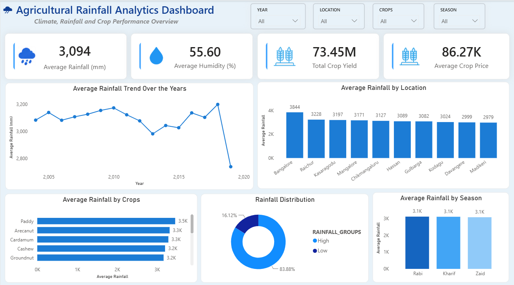

# 🌧 Agricultural Rainfall Analytics Pipeline

An end-to-end cloud analytics solution built using **AWS S3**, **Snowflake**, and **Power BI** to demonstrate a modern ELT workflow for transforming raw agricultural rainfall data into actionable business insights.

---

## 📖 Project Overview

Organisations increasingly rely on cloud-native analytics platforms to centralise, transform, and visualise large datasets. This project demonstrates a complete analytics workflow by simulating how raw data moves through a cloud data platform before reaching business users.

The solution begins by storing raw agricultural rainfall data in **Amazon S3**, followed by secure ingestion into **Snowflake** using a Storage Integration and IAM Role. The data is transformed using SQL to create reporting-ready datasets before being connected directly to **Power BI** for interactive dashboard development. Finally, the report is published to **Power BI Service**, allowing cloud-based access to business insights.

Rather than focusing solely on dashboard creation, this project demonstrates the complete lifecycle of modern cloud analytics—from data ingestion to business reporting.

---

## 🎯 Objectives

- Build an end-to-end cloud analytics pipeline
- Demonstrate Snowflake data ingestion from AWS S3
- Perform SQL-based data transformation
- Develop an interactive Power BI dashboard
- Publish the solution to Power BI Service

---

# 🏗 Solution Architecture

```
                    Raw Dataset
                         │
                         ▼
                Amazon S3 Bucket
                         │
         Storage Integration + IAM Role
                         │
                         ▼
                Snowflake External Stage
                         │
                         ▼
                  COPY INTO Command
                         │
                         ▼
             Snowflake Data Warehouse
                         │
                  SQL Transformations
                         │
                         ▼
                  Reporting Dataset
                         │
                         ▼
                 Power BI Dashboard
                         │
                         ▼
                 Power BI Service
```

---

# ⚙ Technology Stack

| Technology | Purpose |
|------------|---------|
| Amazon S3 | Cloud object storage |
| AWS IAM | Secure authentication |
| Snowflake | Cloud Data Warehouse |
| SQL | Data transformation |
| Power BI Desktop | Dashboard development |
| Power BI Service | Dashboard publishing |

---

# 🔄 Project Workflow

## 1. Data Collection

The agricultural rainfall dataset was obtained from an online source and uploaded into an Amazon S3 bucket.

---

## 2. Cloud Storage Integration

A Snowflake Storage Integration was configured using an AWS IAM Role to establish secure communication with the S3 bucket.

---

## 3. Data Ingestion

An External Stage was created in Snowflake, allowing the CSV dataset stored in Amazon S3 to be loaded directly into the warehouse using the COPY INTO command.

---

## 4. Data Transformation

SQL transformations were applied inside Snowflake to prepare the dataset for reporting.

The transformation process included:

- Creating a reporting table
- Updating rainfall values
- Updating cultivated area values
- Creating Year Groups
- Creating Rainfall Groups

---

## 5. Business Intelligence

The transformed dataset was connected directly to Power BI using the native Snowflake connector.

An executive dashboard was developed featuring:

- KPI Cards
- Rainfall Trends
- Rainfall Distribution
- Seasonal Analysis
- Crop Analysis
- Interactive Filters

---

## 6. Cloud Deployment

The completed dashboard was published to Power BI Service, enabling cloud-based reporting.

---

# 📊 Dashboard Preview

> Replace the image below with your dashboard screenshot.




---

# 📂 Repository Structure

```
architecture/
datasets/
snowflake/
powerbi/
screenshots/
README.md
```

---

# 🧹 SQL Transformations

The reporting dataset was enriched using SQL transformations including:

| Transformation | Description |
|---------------|-------------|
| Rainfall Update | Updated rainfall values |
| Area Update | Updated cultivated area |
| Year Groups | Classified years into reporting periods |
| Rainfall Groups | Categorised rainfall into Low, Medium and High |

---

# 📈 Dashboard Features

✔ Executive KPI Cards

✔ Rainfall Trend Analysis

✔ Seasonal Rainfall Comparison

✔ Rainfall Distribution

✔ Location Analysis

✔ Crop Analysis

✔ Interactive Slicers

✔ Cross Filtering

---

# 💼 Skills Demonstrated

- Cloud Data Warehousing
- Data Engineering Fundamentals
- ELT Workflow
- Snowflake
- AWS S3
- SQL
- Power BI
- Dashboard Design
- Business Intelligence
- Cloud Analytics

---

# 🚀 Future Improvements

- Implement Snowpipe for automated ingestion
- Incremental data loading
- Weather API integration
- Predictive rainfall forecasting
- Row-Level Security (RLS)
- CI/CD deployment pipeline

---

# 👨‍💻 Author

**Vikranthnivas Dhamodharan**

Master of Analytics — Massey University

Interested in Data Analytics, Business Intelligence, Cloud Analytics and Data Engineering.
